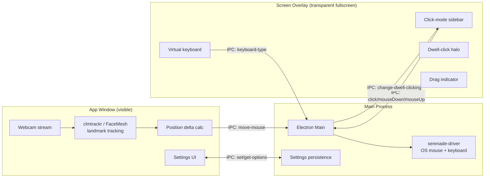

<div align="center">

# Helm

**Steer your cursor — hands-free mouse control with head tracking.**

[](LICENSE.txt)
[](https://github.com/MuhammadAhmed43/Helm/releases)
[](https://www.electronjs.org/)
[](https://www.electronforge.io/)

Helm is a Windows desktop app that lets you control your mouse cursor entirely with your head — no hands required. Built on a webcam-based face tracker, it adds a floating click-mode sidebar, an on-screen keyboard, drag-and-drop support, and a calming modern UI designed for users with motor impairments or anyone who wants to step away from the mouse.

</div>

---

## Table of contents

- [Why Helm exists](#why-helm-exists)
- [Features](#features)
- [Demo](#demo)
- [How it works](#how-it-works)
- [Install](#install)
- [Usage](#usage)
- [Development](#development)
- [Project structure](#project-structure)
- [Tech stack](#tech-stack)
- [Design system](#design-system)
- [Roadmap](#roadmap)
- [License](#license)

---

## Why Helm exists

Mouse-driven UIs are an everyday obstacle for people with motor impairments — repetitive strain, post-surgery recovery, paralysis, or neurological conditions can make a physical mouse painful or impossible to use. Commercial head-tracking accessories cost hundreds of dollars and tie users to proprietary hardware.

Helm is a free, open, Windows-native alternative that needs **nothing but the webcam already in your laptop**. It tracks your face in real time, translates head movement into cursor movement, and dwell-clicks targets you look at. It does it all locally — no cloud, no account, no telemetry.

## Features

| | |
|---|---|
| 🎯 **Real-time head tracking** | Webcam-based facial landmark tracking via [clmtrackr](https://github.com/auduno/clmtrackr) + [MediaPipe FaceMesh](https://github.com/google/mediapipe). Head movement → cursor movement, configurable sensitivity per axis. |
| 🖱️ **Dwell clicking** | Hover over a target for a configurable duration to fire a click. Visual halo previews the click. |
| 🌀 **Click-mode sidebar** | Floating glassmorphic panel: **Left / Right / None / Drag / Keyboard / Scroll ↑ / Scroll ↓** — switch modes hands-free. |
| 🤏 **Drag and drop** | First dwell picks up, second dwell drops. The Drag button pulses red while the mouse button is held so you always know your state. |
| ⌨️ **On-screen keyboard** | Full QWERTY with Shift/Caps state, dark frosted-glass styling, all keys ≥ 48 px for reliable dwell-clicks. |
| 🛟 **Manual takeback** | Touch the physical mouse and Helm yields gracefully — it resumes only after the cursor stops moving. |
| 🚨 **Drag-safety net** | If you toggle off, switch modes, or grab the physical mouse mid-drag, Helm automatically releases the held button so the OS never gets stuck. |
| ⌨️ **Global F9 shortcut** | Toggle tracking from anywhere, even when Helm isn't focused. |
| 🌒 **Light & dark mode** | Auto-adapts to your system theme via `prefers-color-scheme`. |
| 📐 **44 px target floor** | Every interactive element meets the WCAG 2.1 AA touch target guideline. |

## Demo

> Screenshots go in `docs/screenshots/`. Suggested captures: `main-window.png`, `overlay-sidebar.png`, `keyboard.png`, `drag-in-progress.png`.

```
┌─────────────────────────────────────────────────────────┐
│  ▲  Helm                                          —  □ ✕│
│     Steer your cursor.                                  │
├──────────────────────────────┬──────────────────────────┤
│ ┌──────────────────────────┐ │  ┌────────────────────┐  │
│ │   ▶  Start Tracking      │ │  │                    │  │
│ └──────────────────────────┘ │  │  ┌──────────────┐  │  │
│        · READY ·             │  │  │  live camera │  │  │
│                              │  │  │  with mesh   │  │  │
│ Sensitivity                  │  │  │  overlay     │  │  │
│   Horizontal  ━━━●━━━━       │  │  └──────────────┘  │  │
│   Vertical    ━━━━━●━━━      │  │                    │  │
│                              │  │  Face detected     │  │
│ Feel                         │  │  · 30 FPS          │  │
│   Smoothing   ━━━━●━━━━━     │  └────────────────────┘  │
│   Acceleration ━━━━━━●━━     │                          │
│                              │                          │
│ Preferences                  │                          │
│   ◉ Mirror camera view       │                          │
│   ○ Swap mouse buttons       │                          │
│   ○ Start tracking on launch │                          │
│   ○ Run at login             │                          │
├──────────────────────────────┴──────────────────────────┤
│ Press [F9] anytime to toggle tracking      About Helm   │
└─────────────────────────────────────────────────────────┘
```

## How it works

Helm runs as two coordinated Electron windows.



**Key architectural decisions**

- **Separation of windows.** The app window owns camera + tracking; the always-on-top transparent overlay owns the on-screen controls. The overlay never redraws the camera; the camera window never knows about the overlay UI.
- **OS-level input via [`serenade-driver`](https://www.npmjs.com/package/serenade-driver).** A native Node addon that gives us real `setMouseLocation` / `mouseDown` / `mouseUp` / `pressKey` — meaning Helm drags can drag files in Explorer, scrolls can scroll any app, and clicks register as real OS clicks rather than synthetic DOM events.
- **Drag without holding.** Dwell-clicking can't physically "hold down" a button, so drag is a two-step `mouseDown` then `mouseUp` state machine with a visual indicator and automatic release on every cancel path (F9, mode switch, manual takeback).
- **Click-through overlay.** The screen overlay calls `setIgnoreMouseEvents(true)` so clicks pass through to the desktop underneath — only the sidebar and keyboard regions opt back in.
- **Manual takeback.** A short rolling history of cursor positions detects when the user has physically moved the mouse beyond what head tracking emitted; Helm yields control until the cursor goes still again.

## Install

### Option 1 — Pre-built installer (recommended)

Grab the latest release: [**Helm-1.3.0 Setup.exe**](https://github.com/MuhammadAhmed43/Helm/releases/latest)

Double-click the installer. Squirrel will install Helm to `%LocalAppData%\helm` and add a Start menu shortcut. Updates can be applied through the same installer.

> **Windows SmartScreen note:** the installer is unsigned, so you may see a "Windows protected your PC" dialog the first time. Click "More info" → "Run anyway".

### Option 2 — From source

```bash
git clone https://github.com/MuhammadAhmed43/Helm.git
cd Helm/desktop-app
npm install
npm start
```

Requires Node.js ≥ 18 (tested on 20.18) and npm ≥ 9.

### Option 3 — Build the installer yourself

```bash
cd desktop-app
npm install
npm run make
```

Output lands in `desktop-app/out/make/squirrel.windows/x64/`.

> **Windows symlink gotcha:** Electron Forge fails to package if `desktop-app/node_modules/tracky-mouse` is a symlink and Developer Mode is off. Enable Settings → Privacy & security → For developers → Developer Mode, or replace the symlink with a `cp -r` of `core/`.

## Usage

1. **Launch Helm.** The main window shows your camera feed; the floating sidebar appears on the right edge of every monitor.
2. **Press "Start Tracking"** (or hit <kbd>F9</kbd>).
3. **Move your head** to move the cursor. Tilt right → cursor right. Look up → cursor up. Sensitivity and acceleration are tunable in the settings panel.
4. **Dwell on a target** for a fraction of a second to click. The blue halo previews the click.
5. **Use the sidebar** to switch click modes:
   - **Left** (default) — standard left click on dwell.
   - **Right** — right click on dwell.
   - **None** — pause clicking entirely. Useful when you just want to look around.
   - **Drag** — dwell to pick up, head-move to drag, dwell again to drop.
   - **Keyboard** — opens the on-screen QWERTY for typing into focused apps.
   - **Scroll ↑ / ↓** — fires page-up / page-down in the focused app.
6. **Touch your real mouse anytime** — Helm yields and resumes after the cursor goes still.
7. **Hit <kbd>F9</kbd>** anywhere to pause/resume tracking globally.

**Tips for best tracking**

- Position the webcam roughly at eye level and centered.
- Avoid back-lighting (windows behind you) — light *your face*, not the camera.
- A small desk lamp pointed at your face dramatically improves tracking accuracy.
- Disable auto-focus on the camera if possible; it can drift mid-session.

## Development

```bash
cd desktop-app
npm install     # install all electron + native addon deps
npm start       # launch the app with DevTools attached
npm run make    # produce a Squirrel installer
```

**Hot reload**: edit any file in `desktop-app/src/` and hit <kbd>Ctrl</kbd>+<kbd>R</kbd> in the running app to reload the renderer. Main-process changes require a restart (`npm start` again).

**DevTools**: <kbd>F12</kbd> in the main window. For the transparent overlay window, use **View → Toggle Developer Tools (Screen Overlay)**.

**Linting**:

```bash
npm run lint          # cspell + eslint
npm run lint-eslint   # just JS
npm run lint-cspell   # just spell-check
```

## Project structure

```
Helm/
├── core/                          # Face tracking engine
│   ├── tracky-mouse.js            # Landmark tracker — 2,396 lines
│   ├── tracky-mouse.css           # Library default styles
│   ├── facemesh.worker.js         # MediaPipe FaceMesh worker
│   └── lib/                       # Vendored deps (clmtrackr, jsfeat, tf.js)
│
├── desktop-app/                   # Electron app — where Helm lives
│   ├── forge.config.js            # Squirrel installer + maker config
│   ├── package.json               # productName: "Helm", v1.3.0
│   └── src/
│       ├── electron-app.html              # Main window — Helm settings + camera card
│       ├── electron-screen-overlay.html   # Click-through fullscreen overlay
│       ├── screen-overlay.js              # Sidebar / keyboard / drag state machine
│       ├── screen-overlay.css             # Glassmorphic overlay styles
│       ├── preload-app-window.js          # ContextBridge: settings, mouse-move IPC
│       ├── preload-screen-overlay.js      # ContextBridge: clicks, keys, drag
│       └── electron-main/
│           ├── electron-main.js           # Window lifecycle + IPC handlers
│           ├── menus.js                   # Native menu bar (File/Edit/View/Help)
│           ├── cli.js                     # argparse — `helm --start` / `--stop`
│           └── squirrel-update.js         # Install/uninstall hooks for Windows
│
└── images/                                # App icons + readme assets
```

## Tech stack

| Layer | Technology | Why |
|---|---|---|
| Runtime | Electron 20 | Cross-platform desktop with full DOM + Node access |
| Build | Electron Forge 7 + Squirrel | One-command Windows installer |
| Face tracking | clmtrackr + MediaPipe FaceMesh | Pure-JS landmark detection, no native bindings |
| ML acceleration | TensorFlow.js | WebGL-accelerated tensor ops for FaceMesh |
| OS input | serenade-driver | Native addon for real `mouseDown`/`mouseUp`/`pressKey` |
| Window state | electron-window-state | Persist window position across launches |
| CLI | argparse | Second-instance command dispatching |
| Styling | Plain CSS + custom properties | No CSS framework — keeps the bundle lean and the CSP simple |
| Typography | DM Sans (display) + Inter (body) | Modern + highly legible |

## Design system

Helm uses a small, deliberate visual language inspired by Linear, Things 3, and modern accessibility-first tools.

| Token | Value |
|---|---|
| Primary teal | `#2d7d8e` |
| Surface (light) | `#f7fafb` (never pure white — kinder on the eyes during long sessions) |
| Surface (dark) | `#0f1415` |
| Min touch target | **44 × 44 px** (WCAG 2.1 AA) |
| Card radius | `12 px` |
| Hero button radius | `9999 px` (pill) |
| Headings | DM Sans 600 |
| Body | Inter 400 |
| Click-mode color codes | Left = teal · Right = teal · None = grey · Drag = amber (red while held) |

## Roadmap

- [ ] Calibration wizard for first-time setup
- [ ] Mode-switch via head gestures (nod for click, shake for cancel) — eliminating sidebar dwells
- [ ] Auto-tuned sensitivity based on user's typical head-movement range
- [ ] Multi-monitor cursor warping (currently primary display only)
- [ ] macOS and Linux builds (Electron Forge issue [#3238](https://github.com/electron/forge/issues/3238) blocks this)
- [ ] Per-app profiles (different sensitivity for browsing vs. drawing apps)
- [ ] Eye-gaze fallback when face is partially occluded

## License

[MIT](LICENSE.txt)

---

<div align="center">
  <sub>Built with accessibility in mind.</sub>
</div>

<!-- Original face-tracking engine: https://github.com/1j01/tracky-mouse — see LICENSE.txt for copyright. -->
